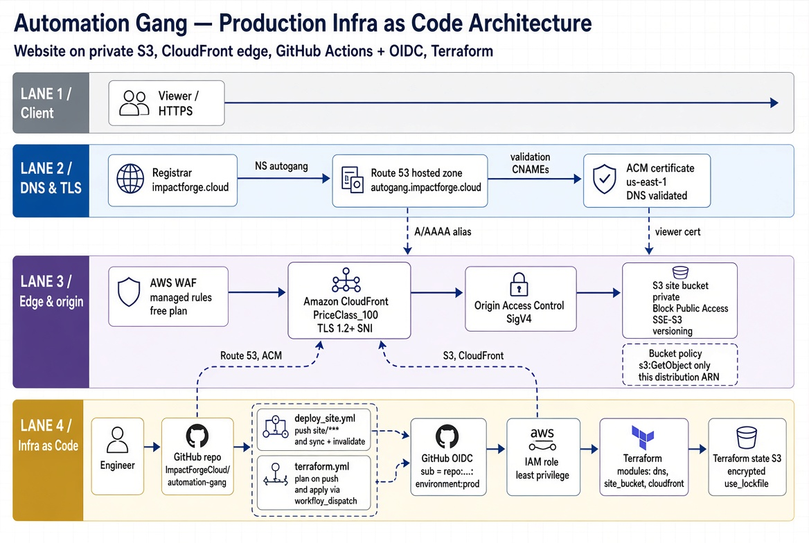

# Automation Gang

Website plus the CI/CD pipeline and Infrastructure as Code that ship it.  
Live: `https://autogang.impactforge.cloud`  
Repo purpose: a replayable production release, not a landing page.

## Architecture

\n
- Main components: IAM (identities, permissions), S3 (host), CloudFront (CDN), Route 53 (DNS), ACM (TLS certificate), OIDC (secure auth), WAF (firewall), GitHub Actions (CI/CD), Terraform (IaC).
- Terraform modules: `site_bucket`, `cloudfront`, `dns`.

## Security

- IAM: Least-privilege role.
- S3 site bucket: AES-256 encryption, private bucket, public access only through Cloudfront.
- Terraform state bucket: AES-256 encryption.
- Cloudfront distribution: OAC (Origin Access Control), bucket policy enforced, locked to the distro ARN.
- ACM certificate: TLS encryption (https).
- GitHub OIDC: standard for secure authentication, no long-lived keys.
- WAF (firewall): protection against common vulnerabilities, blocks IPs based on threat intelligence.

## Reliability

- S3 state bucket lockfile: prevents two Terraform runs from writing state at once.
- S3 site bucket versioning so unwanted changes can be rolled back.
- Terraform state bucket versioning so infra changes can be rolled back.
- `terraform apply` only via `workflow_dispatch`.
- When `terraform.yml` runs, a plan is always produced and a text artifact uploaded for inspection.
- `Prod` environment: infrastructure changes need manual approval.

## Performance

- CloudFront distribution: geo proximity to users, low latency, great end user experience.
- Cloudfront cache policy `caching_optimized`.
- Edge computing can be done if necessary.
- Max out cache to 1 year: website is infrequently changed, and caching means fast website.
- Automatic cache invalidation after site changes: always fresh content.
- Automatic Lighthouse CI testing on `push`: performs audits on the website. Speed, best practices, SEO.

## Operational Excellence

- Two workflows: `deploy_site.yml`, `terraform.yml` (format, validate, plan, manual apply)
- `push` to `site/`: `deploy_site.yml` automatically deploys website changes.
- Path filter `site/`: `deploy_site.yml` only runs on `site/`changes.
- `push` to `terraform/`: `terraform.yml` automatically uploads `plan.txt`.
- Path filter `terraform/`: `terraform.yml` only runs on `terraform/` changes.
- Terraform module layout for code organization and maintainability.
- TLS certificate auto renewal.

## Cost

- Flat-rate CloudFront plan: best for moderate to high traffic.
- Pricing per request also available: best for low traffic, no charges for idle compute.
- Lightweight Cloudfront distro: can serve up to 1400 requests/hour, enough for a moderate-traffic website.
- S3 buckets: low cost, reliable storage for website assets.
- S3 SSE-S3 encryption: keys stored in the bucket itself, means no KMS bill.

## License and Attribution

Copyright © 2026 ImpactForge.  
Author: Jose Neto, Principal Cloud Architect, ImpactForge.  
Licensed under the [GNU Affero General Public License v3.0](LICENSE).

Reuse of this repository, its infrastructure modules, or derivative work requires visible credit in the form below. Do not imply ImpactForge built, endorses, or operates the derivative.

### Required Credit

**In a derivative README** (top of the file, after the title):

```text
Architecture and release pipeline adapted from Automation Gang
https://github.com/ImpactForgeCloud/automation-gang
© 2026 ImpactForge
Licensed under GNU AGPLv3.
```

**On a public website** (footer or colophon, live link):

```html
<p>
  Adapted from
  <a href="https://github.com/ImpactForgeCloud/automation-gang">Automation Gang</a>
  © 2026 ImpactForge
  Licensed under GNU AGPLv3.
</p>
```
